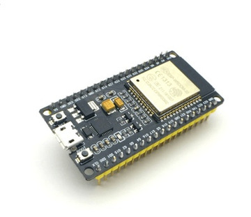
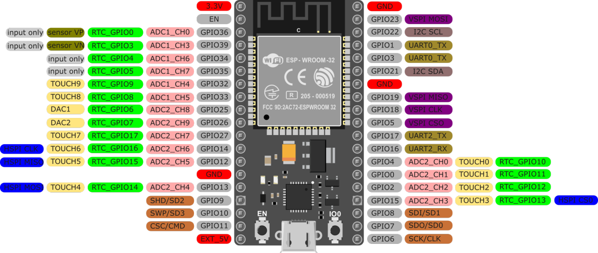
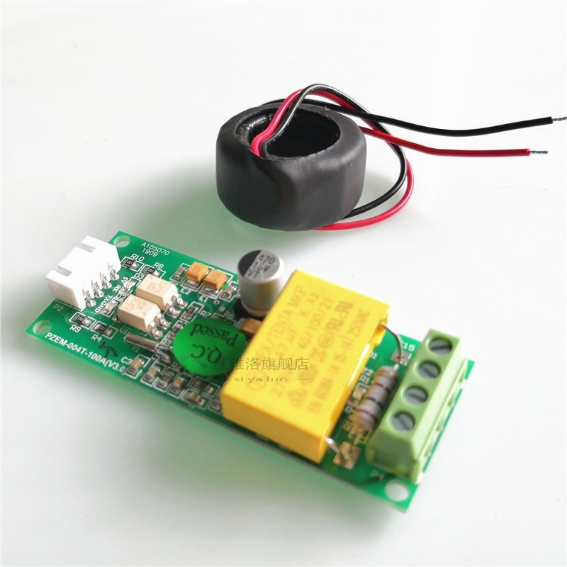
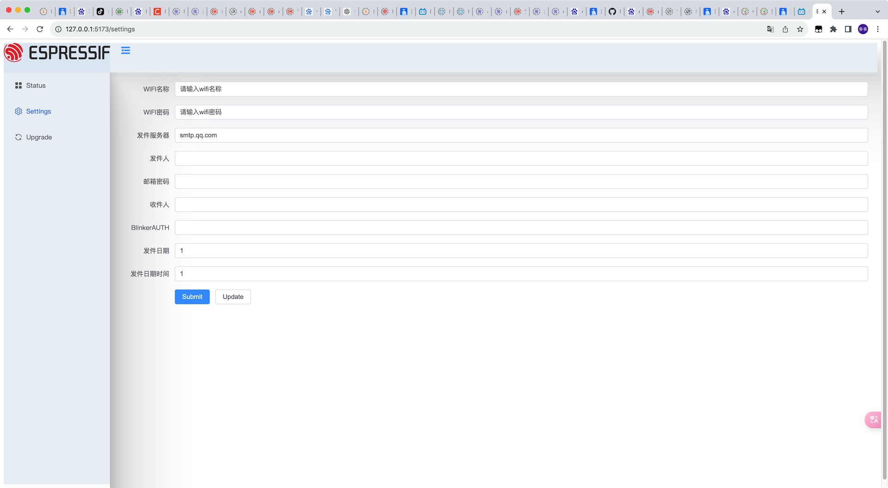

# Smart-Meter
# 项目名称

## 简介
此项目旨在通过 ESP32 实现邮件客户端功能。项目包含多个模块文件，用于管理 WiFi 连接、EEPROM、文件系统等。

## 硬件要求
- ESP32 开发板（例如：ESP32-Solo1）


- pzem-004T 电源模块

## 目录结构
```
- Button.cpp
- Button.h
- Config.h
- Config.cpp
- EEPROMManager.cpp
- EEPROMManager.h
- ESP_Mail_Client_Wrapper.cpp
- ESP_Mail_Client_Wrapper.h
- LittleFS_Manager.h
- LittleFS_Manager.cpp
- NTPTime_Manager.cpp
- NTPTime_Manager.h
- Spiffs_Manager.cpp
- Spiffs_Manager.h
- main.cpp
```

## 依赖项

在开始之前，请确保已经安装以下依赖项：

- [Arduino IDE](https://www.arduino.cc/en/software) 或 [PlatformIO](https://platformio.org/)
- [ESP32 开发板包](https://github.com/espressif/arduino-esp32)（适用于 Arduino IDE）
- WiFi 库（通常在 ESP32 开发环境中默认包含）
- [PlatformIO](https://platformio.org/)库可以离线安装，也可以在线安装。具体参考bilibili视频.

## 安装

### Arduino IDE

1. 打开 Arduino IDE。
2. 转到 `文件 -> 首选项`，在 `附加开发板管理器网址` 中添加以下链接：https://dl.espressif.com/dl/package_esp32_index.json
3. 打开 `工具 -> 开发板 -> 开发板管理器`，搜索并安装 `esp32`。
4. 确认 WiFi 库已经安装（通常在安装 ESP32 开发包时会默认包含）。

### PlatformIO

1. 安装 [VS Code](https://code.visualstudio.com/) 和 [PlatformIO 插件](https://platformio.org/install/ide?install=vscode)。
2. 创建一个新的 PlatformIO 项目，选择 `esp32dev` 开发板。
3. 在 `platformio.ini` 文件中添加所需的依赖项：
```ini
[env:esp32-solo1]
platform = espressif32
board = esp32-solo1
framework = arduino
upload_protocol = esptool
upload_speed = 115200
monitor_speed = 115200
board_build.f_cpu = 16000000L
build_flags = -D PIO_FRAMEWORK_ARDUINO_MMU_EXTERNAL_128K
board_build.partitions = no_ota.csv
lib_deps = 
	joysfera/Tasker@^2.0.3
	mandulaj/PZEM-004T-v30@^1.1.2
	mobizt/ESP Mail Client@^3.4.19
	arduino-libraries/NTPClient@^3.2.1
	paulstoffregen/Time@^1.6.1
```
## 使用
### 配置
1.在 网页中编辑您的 WiFi 和邮箱配置：

2.BlinkerAUTH为下图密钥。


## 常见问题
1. env:esp32-solo1开发板是单核的一般plaformio需要替换SDK,可以参考https://github.com/tasmota/arduino-esp32/releases
2. qq邮箱smtp服务器是smtp.qq.com,端口号465,授权码是邮箱自己获取的,不是密码,频繁使用会封号
3. Blinker客户端需要注册账号,然后创建项目,获取认证码

## 项目参考
1. [https://github.com/lbuque/esp32-vue3demo](https://github.com/lbuque/esp32-vue3demo)